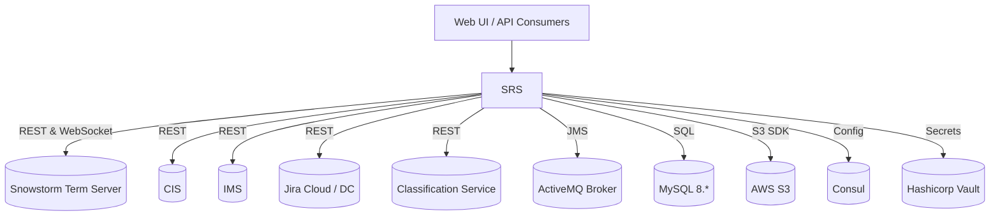
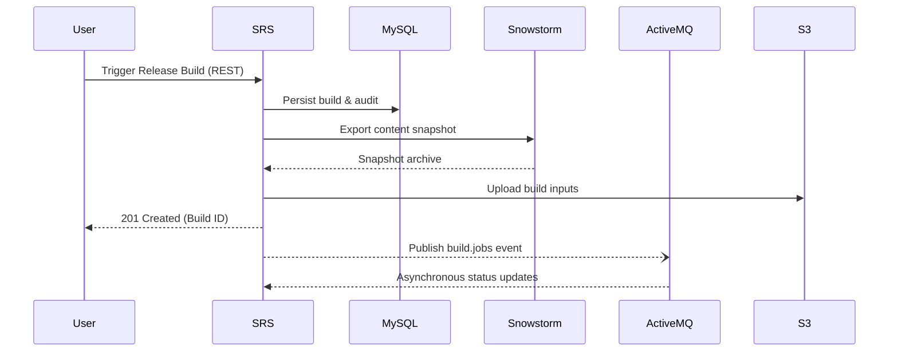

# SNOMED Release Service (SRS)

The **SNOMED Release Service (SRS)** is a Spring Boot–based web application that orchestrates the end-to-end life-cycle of **SNOMED CT release builds** (both production and daily builds). It integrates with a rich ecosystem of backend systems—**Snowstorm**, **CIS**, **IMS**, **Jira**, **ActiveMQ**, **AWS S3**, **Consul**, **Vault** and others—while exposing a **REST / WebSocket API** (documented via Swagger-UI) through which UI clients and automated pipelines can trigger and track releases.

This document explains **how to run SRS locally** and the **engineering best-practices** expected when contributing to the code-base.

---

## 1  High-Level Architecture



<br/>

#### Typical Release-Build Lifecycle



Key points:
* **Stateless** – session information lives in the DB or external services, enabling horizontal scalability.
* **Liquibase** drives schema migrations; these run automatically on start-up.
* **Spring Scheduling, JMS & WebSocket** power asynchronous build processing and client notifications.
* The application is packaged both as a fat **JAR** and a Debian **.deb** for production deployment under `supervisord`.

---

## 2  Feature Highlights

* **Interactive Swagger-UI / OpenAPI 3 docs** – [`SRSApplication.java`](https://github.com/IHTSDO/snomed-release-service/blob/master/src/main/java/org/ihtsdo/buildcloud/SRSApplication.java)
* **SSO-secured Spring Security layer** – configured via `ihtsdo-spring-sso` dependency
* **Release-Build Processing Pipeline**
  * Worker – [`SRSWorkerService`](https://github.com/IHTSDO/snomed-release-service/blob/master/src/main/java/org/ihtsdo/buildcloud/core/service/worker/SRSWorkerService.java)
  * Status listener – [`BuildStatusListenerService`](https://github.com/IHTSDO/snomed-release-service/blob/master/src/main/java/org/ihtsdo/buildcloud/core/service/manager/BuildStatusListenerService.java)
  * **Build status tracking & auto-retry** – `BuildStatusTracker`, `BuildStatusTrackerService`, `InterruptedBuildRetryScheduler` and `InterruptedBuildRetryProcessor` persist per-build status transitions, automatically retry `INTERRUPTED` builds up to a configurable limit, and fail builds stuck in `QUEUED` beyond a timeout.
  * Snowstorm event listeners – [`CodeSystemNewAuthoringCycleHandler`](https://github.com/IHTSDO/snomed-release-service/blob/master/src/main/java/org/ihtsdo/buildcloud/core/service/jms/listener/CodeSystemNewAuthoringCycleHandler.java)
* **JMS Messaging (ActiveMQ)** – configurable queue prefixes (`srs.jms.queue.prefix`) enable multi-tenant deployments
* **Module Storage & Resource Manager** – S3-backed storage for release packages
* **Database schema migrations with Liquibase** – [`db.changelog-master.xml`](https://github.com/IHTSDO/snomed-release-service/blob/master/src/main/resources/org/ihtsdo/srs/db/changelog/db.changelog-master.xml)
* **SimpleCache-based caching layer** for release-center metadata and version look-ups
* **Consul & Vault support** for distributed configuration and secrets management

---

## 3  Project Layout

```
src/
  main/
    java/org/ihtsdo/buildcloud   ← Java sources
    resources/                   ← configuration, templates, Liquibase changelog
  test/                          ← unit & integration tests
```

Package conventions:
* `config`             Spring `@Configuration` classes and beans.
* `rest`               Spring MVC controllers and DTOs.
* `core`               Business logic, services, entities & repositories.
* `jira`               Jira helper utilities and client adapters.
* `telemetry`          Telemetry helpers for build metrics.
* `util`               General-purpose helpers.

---

## 4  Getting Started Locally

### 4.1  Prerequisites

1. **JDK 17** (aligned with the parent BOM)
2. **Maven 3.8+** (wrapper provided)
3. **MySQL 8** running on `localhost:3306` with a database called `srs`.
4. **ActiveMQ 5.x** (an embedded broker starts automatically for local dev, but external brokers are recommended for JMS testing).
5. (Optional) **Snowstorm**, **Classification Service**, **Consul** & **Vault** if you want to mirror a production-like setup.

> Tip: A `docker-compose.yml` for the full stack is planned – contributions welcome!

### 4.2  Clone & Build

```bash
git clone https://github.com/IHTSDO/snomed-release-service.git
cd snomed-release-service
./mvnw clean verify
```

* `verify` executes the test-suite and builds `target/snomed-release-service-${VERSION}.jar`.
* Run `./mvnw -Pdeb package` to also create `target/snomed-release-service-${VERSION}-all.deb`.

### 4.3  Configuration

1. Copy `src/main/resources/application.properties` to `src/main/resources/application-local.properties` (already `.gitignored`).
2. Override at least the following properties:
   ```properties
   spring.datasource.username=<your-db-user>
   spring.datasource.password=<your-db-pwd>
   snowstorm.url=http://localhost:8080/snowstorm/snomed-ct/
   srs.jms.queue.prefix=local-srs
   srs.environment.shortname=local
   ```
3. Any property can also be supplied via environment variables, e.g. `SPRING_DATASOURCE_URL` or `SPRING_MAIL_HOST`.

### 4.4  Run

```bash
java -Xms512m -Xmx4g \
     -jar target/snomed-release-service-${VERSION}.jar \
     --server.port=8081 \
     --server.servlet.contextPath=/api \
     --spring.config.additional-location=classpath:/,file:./ \
     --spring.profiles.active=local
```

Swagger UI will be available at <http://localhost:8081/api/swagger-ui/index.html>.

---

## 5  Messaging & Async Workflows

* JMS queues are prefixed using `srs.jms.queue.prefix` for safe multi-tenant deployments.
* Payload sizes can be tuned via `activemq.max.message.concept-activities`.
* **Consumers must be idempotent** – messages may be redelivered when using ActiveMQ in fail-over mode.

### 5.1  Interrupted Build Retry & Queue Timeouts

SRS tracks build state transitions in the relational database using the `build_status_tracker` table and the `BuildStatusTracker` JPA entity. This enables:

* **Automatic retries for interrupted builds** – when the worker detects that a build was likely interrupted (for example, due to Spot-instance shutdown) it marks the build as `INTERRUPTED`. The manager-side `InterruptedBuildRetryScheduler` periodically scans for the latest `INTERRUPTED` build per product and, if it is still the newest build and under the retry limit, clones the build and re-queues it through `ReleaseBuildManager`. The original tracker remains `INTERRUPTED` but records the retry build id so it is not retried again.
* **Failing builds stuck in `QUEUED`** – the same scheduler also checks `QUEUED` builds whose tracker `last_updated_time` is older than a configurable threshold and marks both the build (in S3) and its tracker as `FAILED`. This protects the system from builds that are never picked up by a worker.

Key configuration properties:

```properties
# Enable/disable the scheduler on manager nodes (defaults to true)
srs.build.retry.enabled=true

# How often the scheduler runs (defaults to 5 minutes)
srs.build.retry.fixed-delay-millis=300000

# How long a build may remain QUEUED before being marked FAILED (defaults to 1 hour)
srs.build.queue.timeout.millis=3600000

# Maximum number of automatic retries for an INTERRUPTED build chain (default 3)
srs.build.interrupted.max-retries=3
```

All of this logic is transparent to API clients: they continue to see build status transitions through the REST and WebSocket APIs, while the retry and timeout behaviour is driven by the configuration above.

---

## 6  Deployment

### 6.1  Fat JAR

```bash
java -Xms512m -Xmx4g \
     -Dspring.profiles.active=prod \
     -jar snomed-release-service-${VERSION}.jar
```

### 6.2  Debian package

1. `./mvnw -Pdeb package`
2. Copy the resulting `.deb` to your server.
3. ```bash
   sudo dpkg -i snomed-release-service-${VERSION}-all.deb
   sudo systemctl restart supervisor        # if applicable
   ```
   Configuration lives under `/opt/snomed-release-service/` and logs under `/var/log/srs/`.
